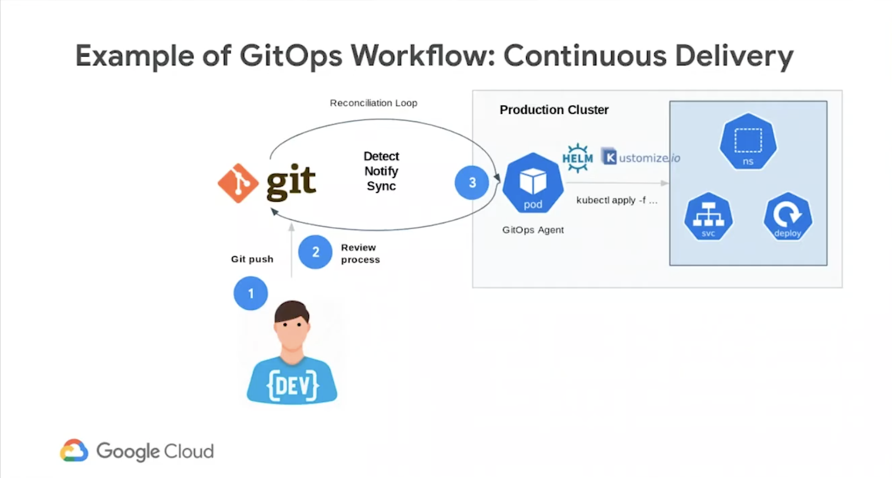

# cicd_with_gitops

References
1. Create a Binary Authorization attestation in a Cloud Build pipeline, https://cloud.google.com/binary-authorization/docs/cloud-build
https://cloud.google.com/kubernetes-engine/docs/tutorials/gitops-cloud-build#standard
3. What is Binary Authorization and how to improve Security in GCP, https://medium.com/codex/what-is-binary-authorization-and-how-to-improve-security-in-gcp-d7e46a26177a

## What is GitOps
First coined by Weaveworks, the term **"GitOps"** is the idea of "environments-as-code": describing your deployments declaratively using files (for example, Kubernetes manifests) stored in a Git repository.

In the original tutorial, you create a CI/CD pipeline that automatically builds a container image from committed code, stores the image in Artifact Registry, updates a Kubernetes manifest in a Git repository, and deploys the application to Google Kubernetes Engine (GKE) using that manifest.

